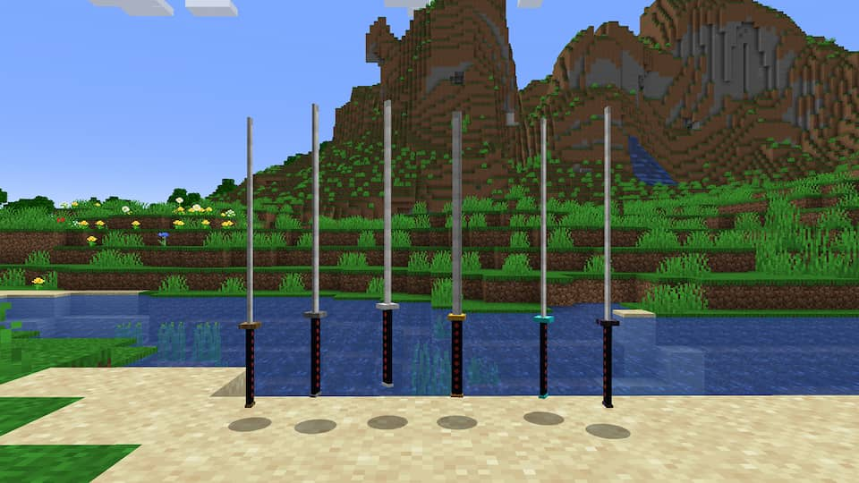
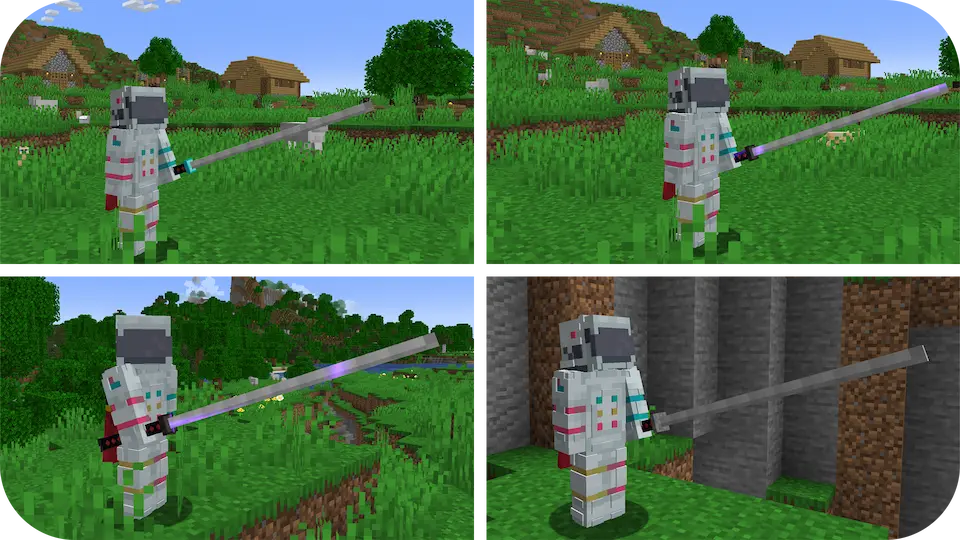
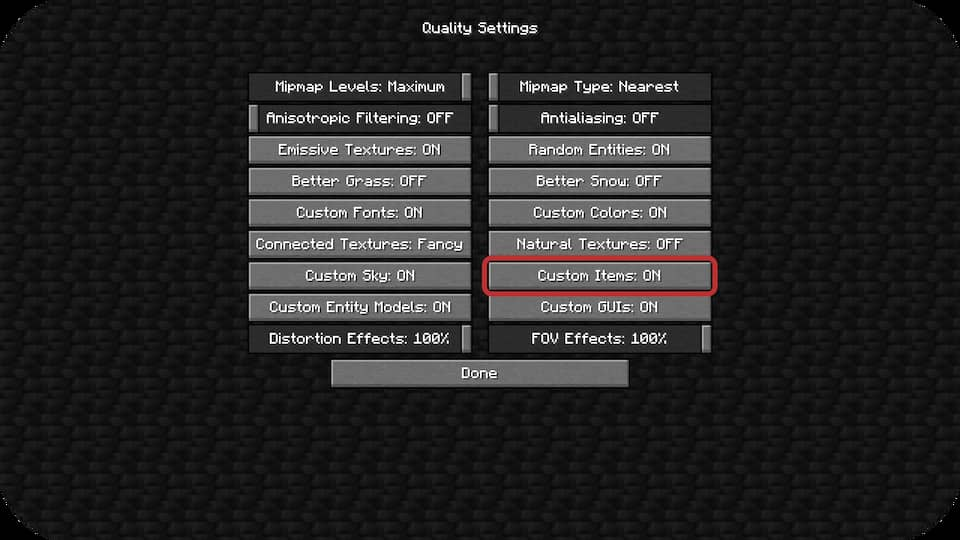
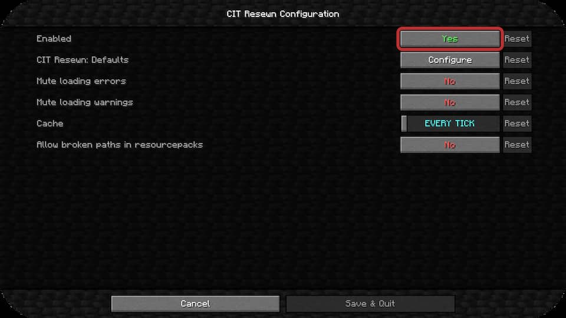

## Ресурспак добавляет 5 моделей катан, для корректной работы необходим<br> [OptiFine](https://optifine.net/downloads) или [CIT Resewn](https://www.curseforge.com/minecraft/mc-mods/cit-resewn/files).


<div align="center">
    <a href="https://www.curseforge.com/minecraft/texture-packs/katanas-pack">CurseForge</a>
    <span> | </span>
    <a href="https://github.com/SolinCode/Katanas-Pack">GitHub</a>
</div>

## Переименуйте мечи на наковальне.
```
minecraft:wooden_sword -> Wooden Katana
minecraft:stone_sword -> Stone Katana
minecraft:iron_sword -> Iron Katana
minecraft:golden_sword -> Golden Katana
minecraft:diamond_sword -> Diamond Katana
minecraft:netherite_sword -> Netherite Katana
```

## Как выглядит


## Для OptiFine:
Video Settings > Quality > Custom Items: ON




## Для CIT Resewn (Mod Menu):
Mods > CIT Resewn > Configure > Enabled: Yes




## Версии на которых тестировался ресурспак:
```
1.19.x (CIT Resewn)
1.18.x (OptiFine)
1.17.x (OptiFine)
```
